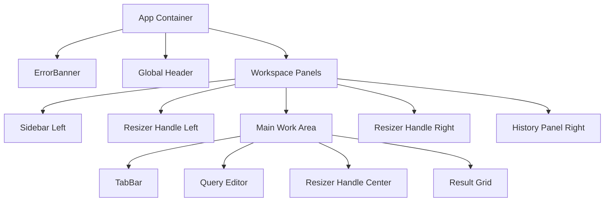

# dbcli-gui UI/UX 設計與一致性指南 (DESIGN.md)

本文件定義了 `dbcli-gui` 應用程式的 UI/UX 設計規範，以確保開發過程中視覺美感與實用性的一致性。

---

## 1. 視覺設計與色彩規範 (Art Direction)

為了提供專業、美觀且不易疲勞的資料庫管理工具體驗，本軟體採用現代極簡主義風格，並避免使用任何 Emoji，全部以高品質的 SVG 圖示進行視覺呈現。

### 1.1 色彩系統 (Color Palette)

採用 HSL 基礎色彩，並利用 Tailwind CSS 變數在淺色與深色模式間無縫切換：

| 元素類型 | 淺色模式 (Light Mode) | 深色模式 (Dark Mode) | 說明 |
| :--- | :--- | :--- | :--- |
| **全域網頁背景** | `bg-slate-50` (`#f8fafc`) | `bg-slate-950` (`#020617`) | 最底層背景 |
| **主要內容/面板背景** | `bg-white` (`#ffffff`) | `bg-slate-900` (`#0f172a`) | 側邊欄、編輯器與結果網格背景 |
| **次要面板/提示背景** | `bg-slate-100` (`#f1f5f9`) | `bg-slate-800/50` | 表頭、分頁列未選中態背景 |
| **主要文字** | `text-slate-800` | `text-slate-200` | 主要閱讀內容 |
| **次要文字/標籤** | `text-slate-500` | `text-slate-400` | 說明文字、時間、狀態描述 |
| **邊框與分割線** | `border-slate-200` | `border-slate-800` | 面板分界線 |
| **品牌主色 (強烈狀態)** | `bg-blue-600` / `text-blue-600` | `bg-blue-500` / `text-blue-400` | 按鈕、選中狀態、游標聚焦 |
| **主鍵/琥珀色高亮** | `text-amber-500` | `text-amber-400` | 用於 Primary Key (PK) 指示 |
| **錯誤/警示色** | `red-600` / `bg-red-50` | `red-400` / `bg-red-950/30` | 錯誤橫幅與無效操作 |

### 1.2 字型規範 (Typography)
- **非等寬字型** (介面與標題)：`"Inter", ui-sans-serif, system-ui, sans-serif`
- **等寬字型** (SQL 編輯器與結果網格)：`ui-monospace, "SF Mono", Menlo, Monaco, Consolas, monospace`
- 表格字型大小採用 `text-xs` (12px) 或 `text-sm` (14px) 以最大化資料可讀性。

---

## 2. 佈局架構與可拖移分割區 (Resizable Layout)

應用程式整體佈局為三欄式（左側欄、中間主工作區、右歷史記錄面板），其中中間工作區又垂直分割為「編輯器」與「結果網格」。

### 2.1 分割拖曳器 (Resizer Handle) 規格
1. **寬度/高度**：
   - 左右拖曳線：寬度為 `4px` (或 `w-1` / `h-full`)。
   - 上下拖曳線：高度為 `4px` (或 `h-1` / `w-full`)。
2. **視覺效果**：
   - 平時為隱形或淡色 border，滑鼠懸浮時呈現 `bg-blue-500` 且游標轉為 `col-resize` 或 `row-resize`。
3. **防干擾機制**：
   - 拖曳時，系統需暫時在全網頁加上 `pointer-events-none select-none`，避免游標移出拖曳線時因滑入 iframe 或文字選取而造成卡頓。
4. **記憶儲存**：
   - 分割面板的寬度 (`sidebarWidth`, `historyWidth`) 與編輯器高度 (`editorHeight`) 需即時儲存至 `localStorage`，在下次開啟時自動還原。

### 2.2 摺疊控制 (Collapsible Panels)
- 在左側欄與右歷史面板的拖曳線上，嵌入一組隱形但 Hover 時顯現的精美摺疊按鈕（SVG 左右 Chevron 圖示）。
- 單擊摺疊按鈕後，面板寬度直接縮至 `0` 像素（`display: none` 或 `overflow: hidden`）。
- 全域標題列/工具列中亦提供對應的 SVG 開關圖示，以確保使用者在面板關閉後仍能輕易開啟。

---

## 3. 三態主題切換 (Theme Management)

系統必須支援 **淺色 (Light)**、**深色 (Dark)** 與 **系統同步 (System)** 三種主題狀態。

### 3.1 主題狀態機
- 狀態儲存鍵：`localStorage.getItem('theme')` (可選值為 `'light'`, `'dark'`, `'system'`)。
- **System 模式監聽**：
  若為 `'system'`，則程式碼需透過 `window.matchMedia('(prefers-color-scheme: dark)')` 來判斷當前系統偏好，並透過 `.addEventListener('change', ...)` 實現系統主題切換時的即時同步。
- **HTML 類別套用**：
  不論何種模式，當最終決定啟用深色時，將 `.dark` 類別加入 `document.documentElement`，否則移除該類別。

### 3.2 樣式適配
- 所有元件的樣式必須善用 Tailwind v4 的 `dark:` 變體。例如：
  `border-slate-200 dark:border-slate-800`
  `bg-white dark:bg-slate-900`

---

## 4. SVG 圖示標準

禁止使用任何 Emojis 或 PNG 圖示。所有圖示均採用 Lucide React 原生 SVG 元件，以實現無極縮放且不失真的清晰視覺：

- **資料庫 (Database)**：`<Database />` - 用於連線列表標頭。
- **資料表 (Table)**：`<Table2 />` - 用於 Sidebar 的資料表類型。
- **檢視表 (View)**：`<Eye />` - 用於 Sidebar 的檢視表類型。
- **主鍵 (Primary Key)**：`<KeyRound />` - 用於資料表結構中的 PK 標示（琥珀色）。
- **執行查詢 (Run)**：`<Play />` - 用於編輯器執行按鈕與側邊欄快速 SELECT 按鈕。
- **匯出結果 (Export)**：`<Download />` - 用於結果網格匯出 csv/json 按鈕。
- **新增分頁 (New Tab)**：`<Plus />` - 用於分頁列的新增按鈕。
- **關閉分頁 (Close Tab)**：`<X />` - 用於分頁標題旁的關閉按鈕。
- **查詢歷史 (History)**：`<History />` - 用於右側歷史面板標頭。
- **清除歷史 (Clear)**：`<Trash2 />` - 用於歷史面板的清空按鈕。
- **搜尋 (Search)**：`<Search />` - 用於搜尋結果或搜尋資料表的輸入框前置圖示。
- **收摺與開關 (Toggles)**：`<ChevronLeft />`, `<ChevronRight />`, `<Columns />`, `<Layout />` - 用於面板開展收摺與佈局快選。
